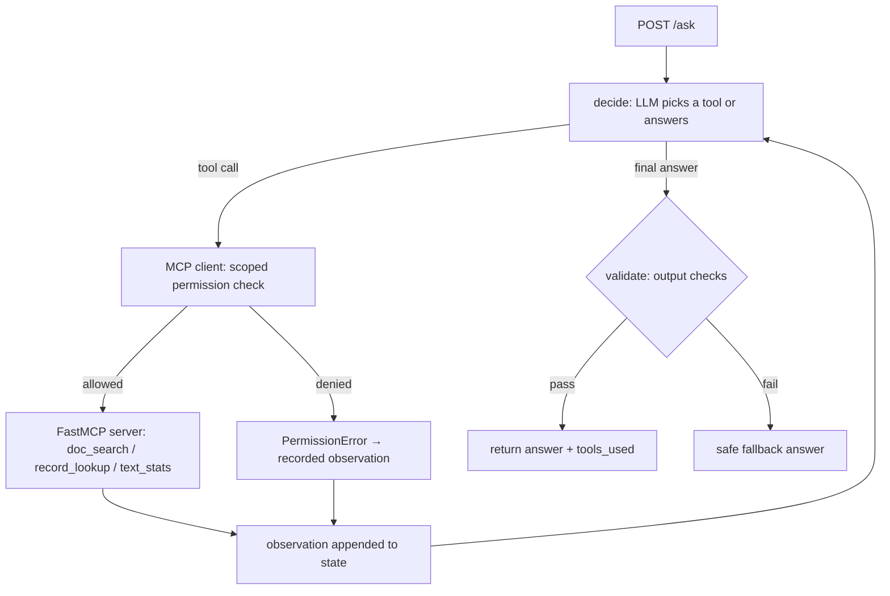

# MCP Agent Toolkit

A production-pattern **FastMCP server + LangGraph agent**: a FastMCP server exposes genuinely working tools (doc search, record lookup, text analysis) with scoped permissions, and a LangGraph agent discovers and calls them over MCP — traced with LangSmith, served over FastAPI, deployable via Docker/Helm/Argo CD.

> **Honesty notes:** all bundled docs and records are **synthetic demo data**. The service runs in **mock mode by default** (deterministic fake LLM, no keys, no cost) and is a reference implementation — not deployed to production, no business metrics claimed. Live AWS Bedrock calls are supported but were not exercised here (no AWS credentials in this environment).

## Architecture



**Components**
- `mcp_toolkit/server.py` — FastMCP server with 3 real tools (all read-only): `doc_search` (BM25 over bundled docs), `record_lookup` (by ID), `text_stats` (counts, reading time, keywords). Runnable standalone: `python -m mcp_toolkit.server` (streamable HTTP on `:8100`).
- `mcp_toolkit/mcp_client.py` — MCP client wrapper with **scoped permissions**: calls outside `allowed_tools` raise `PermissionError`. Connects in-process (tests/dev) or over HTTP via `MCP_SERVER_URL`.
- `mcp_toolkit/agent.py` — LangGraph loop (`decide → act → decide … → validate`), max 4 tool steps.
- `mcp_toolkit/api.py` — FastAPI: `POST /ask`, `GET /tools` (live MCP tool discovery), `GET /health`.

**Observability:** LangSmith tracing auto-enabled when `LANGSMITH_API_KEY` is present; degrades gracefully otherwise.

**Secrets:** AWS Secrets Manager (`mcp-agent-toolkit/config` JSON) first, env vars as fallback. No secrets in code, tests, or history.

## Measured results

Measured locally on 2026-09-23 (mock LLM, in-process MCP, synthetic bundled data):

| Check | Result |
|---|---|
| pytest suite | **18/18 passed** (tools, agent incl. multi-hop + permission scoping, API) |
| Golden-set eval (`eval/run_eval.py`, 6 cases) | **6/6 passed** |
| `POST /ask` latency, n=15, local uvicorn | **p50 15.46 ms**, p95 19.77 ms |

## Setup

```bash
python -m venv .venv && source .venv/bin/activate
pip install -r requirements.txt
```

Mock mode (default):
```bash
MOCK_MODE=true python -m uvicorn mcp_toolkit.api:app --port 8000
```

Standalone MCP server (for external MCP clients):
```bash
MOCK_MODE=true python -m mcp_toolkit.server   # http://0.0.0.0:8100
```

Live Bedrock mode: set `MOCK_MODE=false`, `AWS_REGION`, `BEDROCK_MODEL_ID`; provide keys via Secrets Manager or env.

## Usage

```bash
curl -X POST localhost:8000/ask -H 'Content-Type: application/json' \
  -d '{"question": "What is the refund policy?"}'
# {"answer": "Based on tool results — doc_search: [...]", "tools_used": ["doc_search"], "steps": 1, ...}

curl -X POST localhost:8000/ask -H 'Content-Type: application/json' \
  -d '{"question": "What does the refund policy say, and what is the status of record R-2003?"}'
# multi-hop: tools_used: ["doc_search", "record_lookup"]

curl localhost:8000/tools   # live MCP tool discovery
```

Scoped permissions:
```bash
MCP_ALLOWED_TOOLS=doc_search python -m uvicorn mcp_toolkit.api:app --port 8000
# record_lookup / text_stats calls now raise PermissionError inside the agent
```

## API reference

| Method | Path | Description |
|---|---|---|
| `GET` | `/health` | Liveness; reports `mock_mode`, `allowed_tools` |
| `GET` | `/tools` | Lists tools discovered from the MCP server |
| `POST` | `/ask` | `{"question": str (1–2000 chars)}` → `{"answer", "tools_used", "steps", "latency_ms"}` |

## Deployment

**Docker** (multi-stage, non-root):
```bash
docker build -t ghcr.io/saimudunuri04/mcp-agent-toolkit:latest .
docker run -p 8000:8000 ghcr.io/saimudunuri04/mcp-agent-toolkit:latest
```

**Helm:**
```bash
helm lint helm/mcp-toolkit
helm upgrade --install mcp-toolkit helm/mcp-toolkit --namespace ai-agents --create-namespace
```
Default image: `ghcr.io/saimudunuri04/mcp-agent-toolkit:latest`.

**Argo CD (GitOps):** `argocd/application.yaml` syncs `helm/mcp-toolkit` with automated sync, prune, and self-heal.

**End-to-end loop:** `git push` to `main` → CI runs pytest + golden eval → `cd.yml` builds and pushes `:sha` + `:latest` to GHCR → Argo CD rolls out the new image.

## Project structure

```
mcp_toolkit/          # FastMCP server, MCP client (scoped), LangGraph agent, LLM backends, API
data/docs/            # synthetic docs (5)
data/records.json     # synthetic records (5)
eval/                 # golden-set eval (6 cases) + runner
scripts/              # latency measurement
tests/                # pytest suite (tools, agent, API)
helm/mcp-toolkit/     # Helm chart
argocd/               # Argo CD Application manifest
.github/workflows/    # CI (tests+eval) and CD (build+push to GHCR)
```

## CI status

`ci.yml` runs pytest + golden eval on every push/PR (mock mode). `cd.yml` builds and pushes the image to GHCR on merge to `main` after tests pass.
